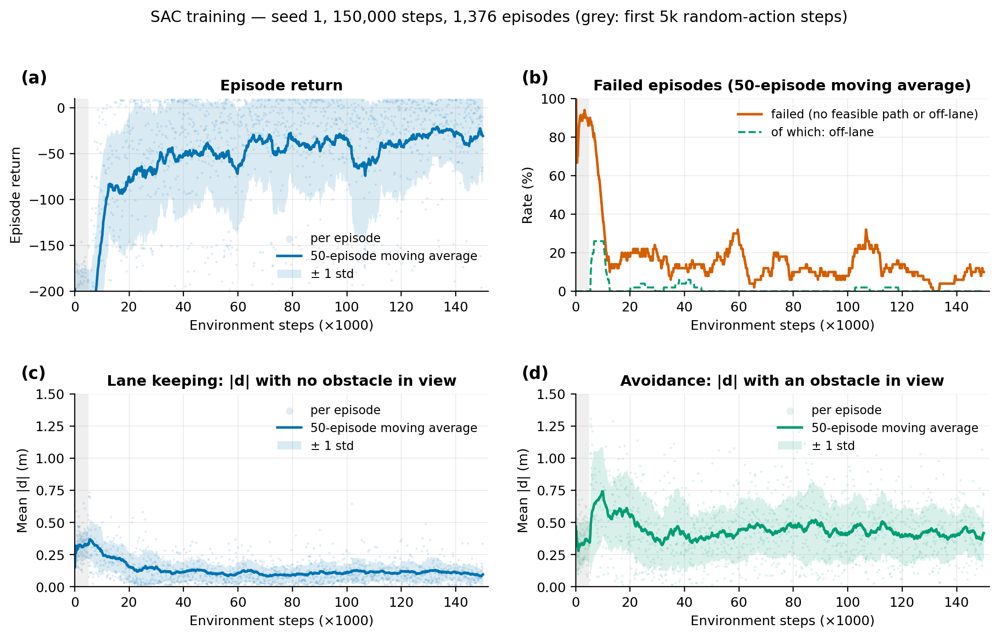
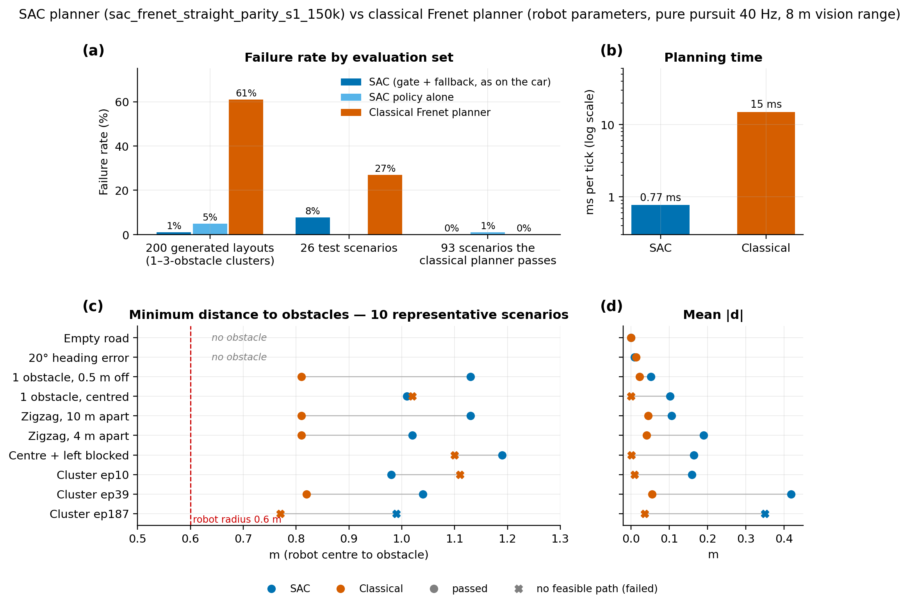

# RL_CAR — Segmentation + Depth Fusion in the Frenet Frame

A full self-driving stack for a differential-drive car on ROS2 Humble /
Jetson Orin. Lane geometry and obstacles from a segmentation and a detection
YOLO model are fused with depth into a single **Frenet-frame** state
(`s, d, heading`), which a Frenet Optimal Trajectory planner and pure-pursuit
controller then track in real time.

> **On the name:** by default the pipeline is **rule-based + classical
> planning** — YOLO perception, an Extended Kalman Filter, and a Frenet
> Optimal Trajectory planner. Reinforcement learning is an **optional,
> config-switched** component: a SAC policy can replace the straight-mode
> planner's cost-based choice of lateral offset (see
> [RL lateral planner](#optional-rl-lateral-planner-sac)).

## Overview

The car carries a depth camera and a GPS unit and drives with only one
control authority: a single node that owns `/cmd_vel`. Everything upstream
of it — perception, GPS, odometry — only supplies data.

```
Sensor Data                Perception module            Lane-frame     Local planner   Control module
 ├─ GPS ────────┐           ├─ Depth Estimation  ┐            │              │               │
 ├─ RealSense ───┼─Camera──►├─ Object Detection  ┼──────────► ├─ vision +    │               │
 │               │Encoder   └─ Line Segmentation ┘            │  encoder     ├─ optimal   ──► ├─ path
 └─ Encoder ─────┘                                            │  fusion      │  path            tracking ──► Actuator
                  └─GPS/Encoder─► Route representation ──────►│  Route-frame │  generation    │  algorithm
                                   (waypoints, curve)          └─ encoder +   │                │
                                                                   gated GPS ─┘                │
```


Two independent state estimates feed the planner, each with its own EKF:

- **Lane-frame** — camera segmentation fused with wheel-encoder odometry
  (`FrenetEKF`, state `[s, d, psi, v]`). This is the primary estimate during
  normal lane following.
- **Route-frame** — wheel-encoder odometry anchored by GPS map-matching
  against a recorded CSV route (`RouteEKF`, state `[x, y, psi]`). This
  estimate only gates in when the car enters a pre-mapped curve zone, where
  vision alone is less reliable; GPS is never allowed to correct the
  lane-frame estimate.

Both feed a **Frenet Optimal Trajectory** planner (quintic lateral × quartic
longitudinal candidate generation, cost-ranked by jerk, time, center offset,
and obstacle clearance), tracked by a pure-pursuit controller.

## Demo

Left: RGB frame with YOLO detection (car bounding box) and lane segmentation
(green centerline) overlaid. Right: the corresponding Frenet/EKF view —
candidate trajectories in gray, the selected path in cyan, the pure-pursuit
lookahead point in magenta.


## Hardware


| | Component | Role |
|---|---|---|
| a | Jetson Orin | GPU compute — perception inference, planning, control |
| b | u-blox M10 GPS module | UBX NAV-PVT fixes for route-frame localization |
| c | Intel RealSense D4xx | RGB + depth for lane segmentation and obstacle detection |
| d | Hoverboard motor controller mainboard | Differential-drive actuation, wheel encoder feedback |
| e | Hub motor wheel | Drive output |

## Key features

- **Segmentation + depth → Frenet frame.** Lane segmentation and depth are
  fused into a lane-relative `(s, d, heading)` state instead of a raw pixel
  or occupancy-grid representation.
- **Detection → Frenet-frame obstacles.** Detected obstacles are projected
  into the same `(s, x)` frame with EMA smoothing and TTL-based tracking.
- **Dual EKF localization.** A camera-driven lane-frame EKF and a
  GPS-driven route-frame EKF run independently; only one is ever allowed to
  steer at a time, and GPS never overwrites the vision estimate outside
  mapped curve zones.
- **Frenet Optimal Trajectory planning** with a curved-reference mode
  (`scipy.CubicSpline` over a recorded GPS route) for sharp mapped curves,
  and a straight-reference mode for ordinary lane following.
- **Single point of control authority.** Only one node ever publishes
  `/cmd_vel`; every other node is read-only with respect to actuation.
- **Optional RL lateral planner.** A SAC policy, trained on the planner's
  own cost function, can pick the straight-mode avoidance offset instead of
  enumerating candidates — switched by one config flag, with a per-tick
  fallback to the classical planner.

## System architecture

7 ROS2 executables across 6 Python subpackages of one `ament_python`
package. Each node splits pure logic (`logic.py` — no `rclpy` import,
testable offline) from ROS wiring (`node.py` — subscribe / publish /
parameters only).

```
joy_pygame_node ──/joy──────┐
encoder_node ────/odom──────┤
perception_node ─/frenet_state──┤──► control_node ──/cmd_vel──► encoder_node → motor controller
gps_node ────────/route_state───┘         │
                                            ├──► visualization_node (read-only debug grid)
planner_motion_node (parallel planner instance, viz/rosbag only — not in the drive path)
```

| Node | Role |
|---|---|
| `perception_node` | Two YOLO models (GPU) on RealSense RGB+Depth: segmentation → lane Frenet state, detection → obstacles projected into Frenet space |
| `control_node` | The only `/cmd_vel` publisher. Two timers on a `MultiThreadedExecutor`: a 50 Hz EKF-predict/manual-drive tick, and a 15 Hz planner tick (Frenet Optimal Planner + pure pursuit + GPS curvature feed-forward) |
| `gps_node` | Reads UBX NAV-PVT, map-matches against a recorded CSV route, publishes route-frame state and detected curve zones |
| `encoder_node` | Owns the motor-controller serial link, decodes wheel RPM, integrates dead-reckoning odometry → `/odom` + TF |
| `planner_motion_node` | A second, independent Frenet planner instance driven only by live camera data — visualization/rosbag use only, never drives the car |
| `visualization_node` | Read-only 2×2 debug grid (camera+segmentation, Frenet/EKF planner, encoder trail, GPS route) |

For the full technical write-up — EKF gating logic, curve-zone handoff,
tuning notes, and known gotchas discovered during field testing — see
[`docs/ARCHITECTURE.vi.md`](docs/ARCHITECTURE.vi.md) (Vietnamese).

## Repository structure

```
RL_CAR/
├── perception/        YOLO segmentation + detection, depth fusion, Frenet projection
├── control/            EKF, planner invocation, pure pursuit, /cmd_vel — the only actuation path
├── planner_motion/     Frenet Optimal Trajectory planner (shared) + a viz-only node
├── Gps/                UBX GPS reader, map matching, route EKF
├── Encoder/            Motor-controller serial link, odometry integration
├── visualization/      Read-only debug overlay
├── config/              rl_car_params.yaml — single source of truth for all node parameters
├── launch/              full_stack.launch.py, rgb_dual_model.launch.py, realsense.launch.py
├── map/                 Recorded GPS route CSVs + curve-zone map
├── scripts/             Build/run scripts, rosbag tooling, offline plotting utilities
├── docs/                 Detailed architecture doc + images used in this README
├── models/               Trained SAC policy for the optional RL lateral planner (+ .meta.json)
├── train_frenet_rl.py    Gymnasium env + SAC training for the RL lateral planner (offline, not a ROS node)
├── test_frenet_rl.py     Evaluates the SAC policy against the classical planner on fixed scenarios
└── frenet_optimal_trajectory.py   Standalone offline reference planner (not part of the live ROS pipeline)
```

## Getting started

```bash
# Build (from the workspace root, the parent of src/)
colcon build --packages-select RL_CAR
source install/setup.bash

# Full stack: camera + perception + control + encoder + joystick + GPS
ros2 launch RL_CAR full_stack.launch.py launch_gps:=true

# Camera pipeline only (e.g. against a rosbag, no hardware GPS/encoder)
ros2 launch RL_CAR rgb_dual_model.launch.py launch_realsense:=false
```

All node parameters — speed limits, EKF noise, planner cost weights, model
paths, topics, GPS gating — live in one file:
[`config/rl_car_params.yaml`](config/rl_car_params.yaml). Rebuild after any
edit (`install/` is a static copy, not a symlink).

### Model weights

Detection and segmentation checkpoints are not committed to this
repository. Place your own weights at:

```
model/detection/yolo11n.pt
model/seg/best.pt
```

or point the `RL_CAR_SOURCE_ROOT` environment variable at a source tree that
already has them (see `perception/model_paths.py`).

## Optional: RL lateral planner (SAC)

In straight mode the classical planner enumerates candidate trajectories
(lateral offset × horizon × speed) and keeps the lowest-cost one. The RL
option replaces that **choice** with a Soft Actor-Critic policy that outputs
the target lateral offset `d_target` and the lateral horizon `Ti`. The same
polynomials build the path, the same pure pursuit tracks it, and curve mode
always stays classical.

**Switching it on.** In [`config/rl_car_params.yaml`](config/rl_car_params.yaml),
under `control_node`:

```yaml
plan_use_rl: true        # false = classical Frenet cost-based (default)
plan_rl_model_path: "~/ros2_ws/src/RL_CAR/models/sac_frenet_straight_parity_s1_150k.zip"
```

This needs `stable-baselines3` and `torch` on the car. They are only
imported when the flag is on.

**What runs on each planner tick**
([`planner_motion/logic.py`](planner_motion/logic.py),
[`planner_motion/rl_policy.py`](planner_motion/rl_policy.py)):

1. **Gate.** The policy first proposes a plain lane-keeping path. The path
   is extended at its final offset to the 8 m vision range. If every
   obstacle stays at least 0.9 m away (robot radius 0.6 m + 0.3 m), that
   path is used.
2. **Policy.** Otherwise the policy chooses `d_target` and `Ti` from the
   observation of the 3 nearest obstacles.
3. **Safety.** The path goes through the planner's hard checks (collision,
   speed, acceleration, curvature). If it fails, that tick falls back to the
   classical planner, so an RL mistake never reaches the motors.

### Model

`models/sac_frenet_straight_parity_s1_150k.zip` (+ `.meta.json`, the
encoding constants from training, which the car needs to decode actions).
It was trained with `train_frenet_rl.py`, a Gymnasium environment around the
straight-mode planner.

| | |
|---|---|
| Algorithm | SAC (stable-baselines3), MlpPolicy, gSDE; lr 3e-4, buffer 200k, batch 256, `learning_starts` 5k; 150k steps, seed 1 |
| Observation (11) | `d`, `psi`, and for each of the 3 nearest obstacles within 8 m: distance, lateral offset, present flag. Mirrored so the nearest obstacle is always on one side; the side is latched per obstacle |
| Action (2) | `d_target` ∈ [−2.4, 2.4] m (signed-square mapping), `Ti` ∈ [2.0, 3.0] s |
| Reward | Minus the classical planner's cost (jerk, time, centre offset, obstacle clearance) + 2 per step; −3000 for no feasible path or leaving the lane; all scaled by 0.05 |
| Simulation | Robot parameters from the config (1 m/s, radius 0.6 m, clearance 1.2 m, lookahead 0.8 m); each decision held 0.5 s, pure pursuit and path rebuild at 40 Hz; 60 m road |
| Scenarios | Clusters of 1–3 static obstacles within 6 m, 12–25 m apart; only layouts that pass the feasibility check below |

**Feasibility check** (`feasible_layout`). The check is geometric and does
not depend on any planner. Obstacles lie within |d| ≤ 1.8 m. Obstacles less
than 1.5 m apart along the road form a row, and every row must leave a gap
of at least 0.9 m inside |d| ≤ 2.2 m. Between rows the car can shift
sideways by at most 0.4 × their distance. A dynamic programme over the
reachable lateral intervals rejects layouts with no way through.

### Training



The curves come from all 1 376 training episodes (50-episode moving
average). They include exploration noise and run without the gate, so they
are worse than the evaluation below.

### Results in simulation

Both planners use the robot's parameters, replan every tick, and choose `Ti`
from the same 2.0–3.0 s range. "SAC" is the full logic used on the car:
gate, policy, hard checks and fallback.



| | Classical planner | SAC |
|---|---|---|
| Failures, 200 generated layouts | 122/200 | **2/200** (policy alone: 10/200) |
| Failures, 26 test scenarios | 7/26 | **2/26** |
| Scenarios the classical planner passes but SAC fails | — | **0/93** |
| Min distance to obstacles, 5th percentile | — | 0.93 m |
| Lane offset on an empty road | 0.00 m | 0.00 m |
| Planning time per tick | ~15 ms | 0.8 ms |

- **No collisions.** Every failure is "no feasible path". The classical
  planner stays near the centre (`plan_center_weight` 20) until the obstacle
  is too close to avoid. SAC starts avoiding earlier.
- **Trade-off.** SAC swerves wider (mean |d| 0.1–0.4 m vs 0.02–0.06 m with
  several obstacles) and keeps more distance (1.0–1.2 m vs 0.81 m).
- **Videos.** Side-by-side videos of the 10 representative scenarios are in
  [`videos_report/`](videos_report/) (`<scenario>_compare.mp4`, SAC left,
  classical right).

**Caveats**
- One seed, simulation only. Evaluation layouts come from the training
  generator, with different seeds.
- Path length is not the cause of the gap: with the same fixed `Ti` for
  both planners (`--horizon 3.0`) the results are unchanged.
- Both planners receive the same obstacles, but the classical cost only
  penalises obstacles near its 2–3 m path, while the gate checks up to 8 m.
  Part of SAC's earlier reaction comes from this hand-written gate. A
  classical planner with the same 8 m check has not been compared.

### Commands

```bash
pip install -r requirements.txt
python3 train_frenet_rl.py                          # train; writes models/sac_frenet_straight.zip + .meta.json
python3 test_frenet_rl.py [model] [--set single|multi|hard|all|report] [--video DIR] [--horizon T]
python3 compare_rl_frenet.py [model] [--multi]      # result tables
```

## Known limitations

- Encoder odometry is unfiltered dead reckoning — it accumulates drift,
  especially wheel slip on sharp turns. This is the reason both EKFs exist.
- GPS is only trusted to correct lateral position once, on entry to a
  pre-mapped curve zone — treating it as a continuous correction source was
  found to let a single bad reading teleport the pose by several meters.
- `frenet_optimal_trajectory.py` at the package root is an offline reference
  implementation (curved cubic-spline planner), kept for experimentation —
  it is not wired into the live ROS pipeline.
- The RL lateral planner has only been validated in simulation.
- The simulation integrates `FrenetEKF.predict` unchanged and flips the sign
  of pure pursuit's `angular_z`. The sign convention (+d right, −d left) is
  unchanged. With the robot's settings, this is the only sign combination
  under which the tuned classical planner holds the lane in simulation.
  The change is confined to `sim_predict` in `train_frenet_rl.py`;
  `control/ekf.py` and `control/pure_pursuit.py` are unchanged.
- `plan_clearance` was lowered from 3.2 m to 1.2 m. This also changes the
  classical planner on the car: it now passes closer to obstacles.
- The obstacle vision range used in training is 8 m. The perception config
  has no explicit range limit, so check that obstacles are actually
  detected that far on the car.

## License

MIT — see [LICENSE](LICENSE).
