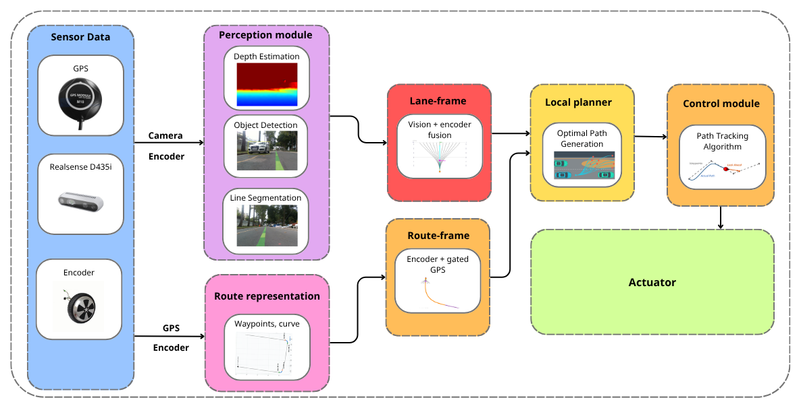
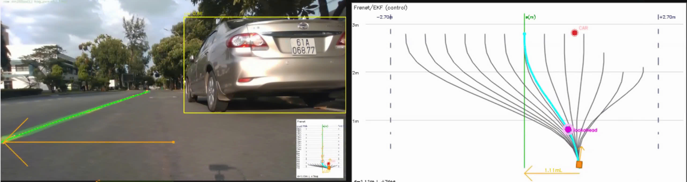
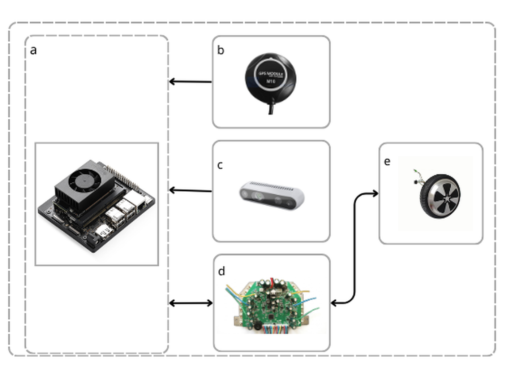

# RL_CAR — Segmentation + Depth Fusion in the Frenet Frame

A full self-driving stack for a differential-drive car on ROS2 Humble /
Jetson Orin. Lane geometry and obstacles from a segmentation and a detection
YOLO model are fused with depth into a single **Frenet-frame** state
(`s, d, heading`), which a Frenet Optimal Trajectory planner and pure-pursuit
controller then track in real time.

> **On the name:** by default the pipeline is **rule-based + classical
> planning** — YOLO perception, an Extended Kalman Filter, and a Frenet
> Optimal Trajectory planner. Reinforcement learning is an **optional,
> config-switched** component: a SAC policy can replace the straight-mode
> planner's cost-based choice of lateral offset (see
> [RL lateral planner](#optional-rl-lateral-planner-sac)).

## Overview

The car carries a depth camera and a GPS unit and drives with only one
control authority: a single node that owns `/cmd_vel`. Everything upstream
of it — perception, GPS, odometry — only supplies data.

```
Sensor Data                Perception module            Lane-frame     Local planner   Control module
 ├─ GPS ────────┐           ├─ Depth Estimation  ┐            │              │               │
 ├─ RealSense ───┼─Camera──►├─ Object Detection  ┼──────────► ├─ vision +    │               │
 │               │Encoder   └─ Line Segmentation ┘            │  encoder     ├─ optimal   ──► ├─ path
 └─ Encoder ─────┘                                            │  fusion      │  path            tracking ──► Actuator
                  └─GPS/Encoder─► Route representation ──────►│  Route-frame │  generation    │  algorithm
                                   (waypoints, curve)          └─ encoder +   │                │
                                                                   gated GPS ─┘                │
```



Two independent state estimates feed the planner, each with its own EKF:

- **Lane-frame** — camera segmentation fused with wheel-encoder odometry
  (`FrenetEKF`, state `[s, d, psi, v]`). This is the primary estimate during
  normal lane following.
- **Route-frame** — wheel-encoder odometry anchored by GPS map-matching
  against a recorded CSV route (`RouteEKF`, state `[x, y, psi]`). This
  estimate only gates in when the car enters a pre-mapped curve zone, where
  vision alone is less reliable; GPS is never allowed to correct the
  lane-frame estimate.

Both feed a **Frenet Optimal Trajectory** planner (quintic lateral × quartic
longitudinal candidate generation, cost-ranked by jerk, time, center offset,
and obstacle clearance), tracked by a pure-pursuit controller.

## Demo

Left: RGB frame with YOLO detection (car bounding box) and lane segmentation
(green centerline) overlaid. Right: the corresponding Frenet/EKF view —
candidate trajectories in gray, the selected path in cyan, the pure-pursuit
lookahead point in magenta.



## Hardware



| | Component | Role |
|---|---|---|
| a | Jetson Orin | GPU compute — perception inference, planning, control |
| b | u-blox M10 GPS module | UBX NAV-PVT fixes for route-frame localization |
| c | Intel RealSense D4xx | RGB + depth for lane segmentation and obstacle detection |
| d | Hoverboard motor controller mainboard | Differential-drive actuation, wheel encoder feedback |
| e | Hub motor wheel | Drive output |

## Key features

- **Segmentation + depth → Frenet frame.** Lane segmentation and depth are
  fused into a lane-relative `(s, d, heading)` state instead of a raw pixel
  or occupancy-grid representation.
- **Detection → Frenet-frame obstacles.** Detected obstacles are projected
  into the same `(s, x)` frame with EMA smoothing and TTL-based tracking.
- **Dual EKF localization.** A camera-driven lane-frame EKF and a
  GPS-driven route-frame EKF run independently; only one is ever allowed to
  steer at a time, and GPS never overwrites the vision estimate outside
  mapped curve zones.
- **Frenet Optimal Trajectory planning** with a curved-reference mode
  (`scipy.CubicSpline` over a recorded GPS route) for sharp mapped curves,
  and a straight-reference mode for ordinary lane following.
- **Single point of control authority.** Only one node ever publishes
  `/cmd_vel`; every other node is read-only with respect to actuation.
- **Optional RL lateral planner.** A SAC policy, trained on the planner's
  own cost function, can pick the straight-mode avoidance offset instead of
  enumerating candidates — switched by one config flag, with a per-tick
  fallback to the classical planner.

## System architecture

7 ROS2 executables across 6 Python subpackages of one `ament_python`
package. Each node splits pure logic (`logic.py` — no `rclpy` import,
testable offline) from ROS wiring (`node.py` — subscribe / publish /
parameters only).

```
joy_pygame_node ──/joy──────┐
encoder_node ────/odom──────┤
perception_node ─/frenet_state──┤──► control_node ──/cmd_vel──► encoder_node → motor controller
gps_node ────────/route_state───┘         │
                                            ├──► visualization_node (read-only debug grid)
planner_motion_node (parallel planner instance, viz/rosbag only — not in the drive path)
```

| Node | Role |
|---|---|
| `perception_node` | Two YOLO models (GPU) on RealSense RGB+Depth: segmentation → lane Frenet state, detection → obstacles projected into Frenet space |
| `control_node` | The only `/cmd_vel` publisher. Two timers on a `MultiThreadedExecutor`: a 50 Hz EKF-predict/manual-drive tick, and a 15 Hz planner tick (Frenet Optimal Planner + pure pursuit + GPS curvature feed-forward) |
| `gps_node` | Reads UBX NAV-PVT, map-matches against a recorded CSV route, publishes route-frame state and detected curve zones |
| `encoder_node` | Owns the motor-controller serial link, decodes wheel RPM, integrates dead-reckoning odometry → `/odom` + TF |
| `planner_motion_node` | A second, independent Frenet planner instance driven only by live camera data — visualization/rosbag use only, never drives the car |
| `visualization_node` | Read-only 2×2 debug grid (camera+segmentation, Frenet/EKF planner, encoder trail, GPS route) |

For the full technical write-up — EKF gating logic, curve-zone handoff,
tuning notes, and known gotchas discovered during field testing — see
[`docs/ARCHITECTURE.vi.md`](docs/ARCHITECTURE.vi.md) (Vietnamese).

## Repository structure

```
RL_CAR/
├── perception/        YOLO segmentation + detection, depth fusion, Frenet projection
├── control/            EKF, planner invocation, pure pursuit, /cmd_vel — the only actuation path
├── planner_motion/     Frenet Optimal Trajectory planner (shared) + a viz-only node
├── Gps/                UBX GPS reader, map matching, route EKF
├── Encoder/            Motor-controller serial link, odometry integration
├── visualization/      Read-only debug overlay
├── config/              rl_car_params.yaml — single source of truth for all node parameters
├── launch/              full_stack.launch.py, rgb_dual_model.launch.py, realsense.launch.py
├── map/                 Recorded GPS route CSVs + curve-zone map
├── scripts/             Build/run scripts, rosbag tooling, offline plotting utilities
├── docs/                 Detailed architecture doc + images used in this README
├── models/               Trained SAC policy for the optional RL lateral planner (+ .meta.json)
├── train_frenet_rl.py    Gymnasium env + SAC training for the RL lateral planner (offline, not a ROS node)
├── test_frenet_rl.py     Evaluates the SAC policy against the classical planner on fixed scenarios
└── frenet_optimal_trajectory.py   Standalone offline reference planner (not part of the live ROS pipeline)
```

## Getting started

```bash
# Build (from the workspace root, the parent of src/)
colcon build --packages-select RL_CAR
source install/setup.bash

# Full stack: camera + perception + control + encoder + joystick + GPS
ros2 launch RL_CAR full_stack.launch.py launch_gps:=true

# Camera pipeline only (e.g. against a rosbag, no hardware GPS/encoder)
ros2 launch RL_CAR rgb_dual_model.launch.py launch_realsense:=false
```

All node parameters — speed limits, EKF noise, planner cost weights, model
paths, topics, GPS gating — live in one file:
[`config/rl_car_params.yaml`](config/rl_car_params.yaml). Rebuild after any
edit (`install/` is a static copy, not a symlink).

### Model weights

Detection and segmentation checkpoints are not committed to this
repository. Place your own weights at:

```
model/detection/yolo11n.pt
model/seg/best.pt
```

or point the `RL_CAR_SOURCE_ROOT` environment variable at a source tree that
already has them (see `perception/model_paths.py`).

## Optional: RL lateral planner (SAC)

In straight mode the classical planner enumerates ~117 candidate
trajectories (lateral offset × horizon × speed) and keeps the lowest-cost
one. The RL option replaces that **choice** with a Soft Actor-Critic policy
that outputs the target lateral offset `d_target` and lateral horizon `Ti`
directly. Everything else is unchanged: the same quintic/quartic polynomials
build the single chosen path, the same pure pursuit tracks it, and curve mode
always stays classical.

**Switching it on** — in [`config/rl_car_params.yaml`](config/rl_car_params.yaml),
under `control_node`:

```yaml
plan_use_rl: true        # false = classical Frenet cost-based (default)
plan_rl_model_path: "~/ros2_ws/src/RL_CAR/models/sac_frenet_straight.zip"
```

It needs `stable-baselines3` and `torch` on the car; they are only imported
when the flag is on. Every RL path still goes through the planner's hard
checks (collision, speed, acceleration, curvature). If a path fails, that
tick falls back to the classical planner and `control_node` logs a warning,
so an RL mistake never reaches the motors.

**How it was trained** — `train_frenet_rl.py` wraps the straight-mode
planner in a Gymnasium environment:

- **Observation:** `[d, psi, distance to the nearest obstacle ahead, its lateral offset]`.
- **Reward:** exactly the negative of the classical planner's cost (jerk,
  time, center offset, obstacle clearance), plus terminal terms for
  collision, leaving the lane, and reaching the goal. The policy therefore
  optimises the same objective the classical planner minimises by search.

The observation/action encoding lives in
[`planner_motion/rl_policy.py`](planner_motion/rl_policy.py) and is shared
by training and the live node. The constants used at training time are saved
next to the model (`.meta.json`), so decoding on the car matches training
even if the robot's `plan_*` parameters differ.

```bash
pip install -r requirements.txt
python3 train_frenet_rl.py   # trains, writes models/sac_frenet_straight.zip + .meta.json
python3 test_frenet_rl.py    # SAC vs classical on 10 fixed scenarios, one process per method
```

**Results in simulation** (10 scenarios: no obstacle, obstacles swept across
the lane from −1.5 m to +1.5 m, and ±20° initial heading error; continuous
actions as used on the car):

| | Classical (cost-based) | SAC |
|---|---|---|
| Collisions | 0 / 10 | 0 / 10 |
| Planning time per tick | 12.4 ms | 0.96 ms (~13× faster) |
| Lane-centre offset, no obstacle | 0.00 m | ~0.29 m |

The SAC policy plans much faster and avoids obstacles safely, but it holds
the lane centre less precisely than the classical planner. An obstacle
exactly on the centreline is the hardest case: left and right are equally
good, so a single-mode policy tends to average them and drive straight.
Oversampling centred obstacles during training reduced collisions there
from 14/20 to 1/20.

`test_frenet_rl.py` rounds SAC's continuous offset to the classical
planner's 0.4 m grid for a like-for-like comparison. In the exactly
symmetric centred-obstacle scenario, that rounding keeps snapping the small
first corrections back to 0, so the script reports 1/10 collisions for SAC.
With the continuous actions used on the car, the same scenario passes.

## Known limitations

- Encoder odometry is unfiltered dead reckoning — it accumulates drift,
  especially wheel slip on sharp turns. This is the reason both EKFs exist.
- GPS is only trusted to correct lateral position once, on entry to a
  pre-mapped curve zone — treating it as a continuous correction source was
  found to let a single bad reading teleport the pose by several meters.
- `frenet_optimal_trajectory.py` at the package root is an offline reference
  implementation (curved cubic-spline planner), kept for experimentation —
  it is not wired into the live ROS pipeline.
- The RL lateral planner has only been validated in simulation. The
  shipped model was trained with the training script's planner settings
  (2.0 m/s, 3.5–4.0 s horizon), which differ from the robot config (1.0 m/s,
  2–3 s), so on-car behaviour will differ from the simulation results.
  Retrain with the robot's settings before relying on it.

## License

MIT — see [LICENSE](LICENSE).
